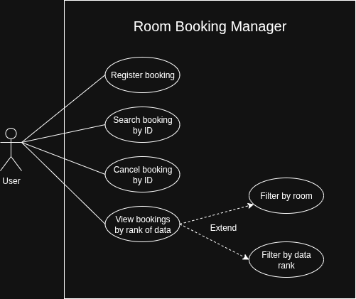
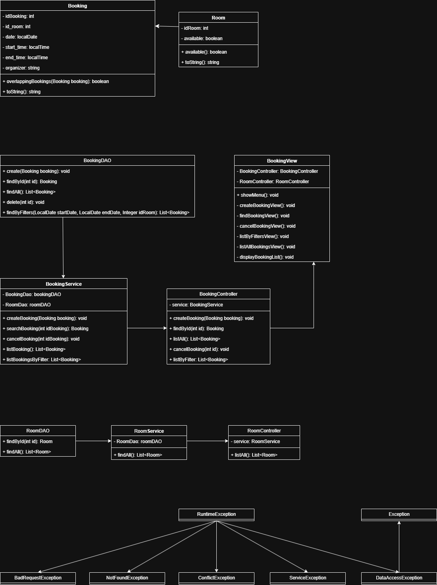
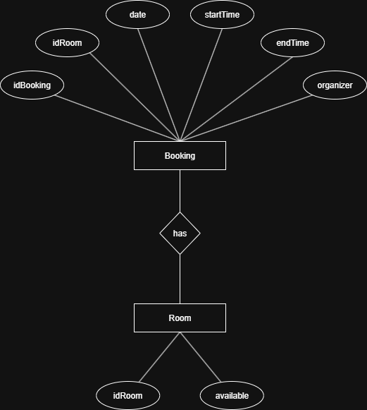

# Room Booking Manager

## 🎯 Objective

This project is a console application for managing meeting room reservations. It allows you to create, view, cancel, and list reservations, implementing robust exception handling to simulate HTTP response codes and ensure data integrity.

---

## 🚀 Main Features

- **Create Reservation:** Schedule a new reservation for a room on a specific date and time.

- **View Reservation:** Search and display the details of a reservation by its ID.

- **Cancel Reservation:** Delete an existing reservation by its ID.

- **List Reservations**: Display all reservations or filter by a date range and/or room.

---

## ⚙️ System Requirements
|Requirement|Recommended Version|
|---|---|
|`Java JDK`|17 or higher|
|`IDE`|IntelliJ IDEA / VS Code / Eclipse|
|`Database`|PostgreSQL 14+ or MySQL 8+|
|`JDBC Driver`|PostgreSQL JDBC Driver (postgresql-42.x.x.jar)|

---

## 📥 Download JDBC Driver:

* **PostgreSQL** → https://jdbc.postgresql.org/download.html
* **MySQL** → https://dev.mysql.com/downloads/connector/j/

---

## 🧰 Connection configuration

1. **Database Configuration:**

``` sql
-- Creating the room table
CREATE TABLE rooms (
id_room INT PRIMARY KEY,
available BOOLEAN NOT NULL DEFAULT TRUE
);
```

``` sql
-- Creating the reservation table
CREATE TABLE bookings (
id_booking SERIAL PRIMARY KEY,
id_room INT NOT NULL,
booking_date DATE NOT NULL,
start_time TIME NOT NULL,
end_time TIME NOT NULL,
organizer VARCHAR(255) NOT NULL,
FOREIGN KEY (id_room) REFERENCES rooms(id_room)
);
```

``` sql
-- Inserting example rooms
INSERT INTO rooms (id_room, available) VALUES (101, TRUE);
INSERT INTO rooms (id_room, available) VALUES (102, TRUE);
INSERT INTO rooms (id_room, available) VALUES (103, FALSE); -- Room out of service
```

2. **Edit the file:**
   `/src/config/DbConfig.java`
3. **Ensure that the values are configured correctly:**
```
private static final String URL = "jdbc:postgresql://aws-1-us-east-2.pooler.supabase.com:6543/postgres";
private static final String USER = "postgres.ponquqmrnqgynmrzmmsr";
private static final String PASSWORD="";
```
---
## 📌 How to add the .jar in IntelliJ:

1. Download the **JDBC driver.**
2. Go to **`File → Project Structure → Modules → Dependencies.`**
3. Click on **`+ → “JARs or directories...” → select the .jar.`**
4. **Apply** and **save.**
---
## 🗂️ Project structure
```/src
 ├── app/               → Main class and system startup
 ├── controller/        → Controllers (coordinate flow between view and service)
 ├── view/              → Console view / interactive menus
 ├── domain/            → Domain entities (Ticket, User, Comment, etc.)
 ├── dao/               
 │   ├── interfaces/    → DAO interfaces (contracts)
 │   └── impl/          → JDBC implementations
 ├── service/           
 │   ├── interfaces/    → Service interfaces (business logic)
 │   └── impl/          → Service implementations
 ├── config/            → Connection configuration (DbConfig)
 └── util/              → Validations and helpers
 ```
---

## ✅ Use Cases and Validations

The system applies several business rules to maintain data consistency.

**Create Reservation**
- **Mandatory data:** The room, date, start time, end time, and organizer are verified to be non-null or empty.

- **Valid time range:** The `startTime` must be before the `endTime`.

- **Existing and available room:** The room (`idRoom`) is verified to exist and its `available` status is `TRUE`.

- **Schedule conflict:** A reservation cannot be created if another reservation already exists for the same room at an overlapping time.

**Check and Cancel Reservation**
- **Existing reservation:** The provided `idBooking` is validated to match an existing reservation before performing the operation.

**List with Filters**
- **Data Format:** Validates that dates (`YYYY-MM-DD`) and room ID (numeric) are formatted correctly.
---
## 🗺️ Mapping Exceptions to Response Codes

|Exception| Simulated Code (HTTP)                                                                                                                                                                                                                                                                                                                                                                                                                               |Description|
|---|-----------------------------------------------------------------------------------------------------------------------------------------------------------------------------------------------------------------------------------------------------------------------------------------------------------------------------------------------------------------------------------------------------------------------------------------------------|--------------------------|
|`BadRequestException`|**400 Bad Request**|The data provided is invalid, incomplete, or incorrectly formatted.|                                                                                                                                                                                                                                                                                                                                                                                                                                |
|`NotFoundException`|**404 Not Found**|The requested resource (reservation or room) does not exist.|    
|`ConflictException`|**409 Conflict**|The request could not be completed due to a conflict (schedule clash, room out of service).|    
|`ServiceException`|**500 Internal Error**|An unexpected technical error occurred on the server (e.g., failure to connect to the database). The root cause is preserved.|    
|`Exception`|**500 Internal Error**|An unhandled or unexpected error.|
---
## 📝 Check-in and Check-out Examples

Below are some interaction flows with the app.

### Success Case: Creating a Valid Reservation

- **App:** Choose a room: [Room 101 (Available), Room 102 (Available)]
- **User:** `Room 101 (Available)`
- **App:** Enter Date (YYYY-MM-DD):
- **User:** `2025-10-27`
- **App:** Enter Start Time (HH:MM):
- **User:** `14:00`
- **App:** Enter End Time (HH:MM):
- **User:** `15:30`
- **App:** Enter Organizer Name:
- **User:** `Juan Perez`
- **App:** `STATUS 201: Booking created successfully!`

### Conflict Case: Time Slot Conflict
- **App:** Choose a room: [Room 101 (Available), Room 102 (Available)]
- **User:** `Room 101 (Available)`
- **App:** Enter Date (YYYY-MM-DD):
- **User:** `2025-10-27`
- **App:** Enter Start Time (HH:MM):
- **User:** `14:30`
- **App:** Enter End Time (HH:MM):
- **User:** `16:00`
- **App:** Enter Organizer Name:
- **User:** `Ana Gomez`
- **App:** `STATUS 409: Time slot conflict: The room is already booked in the selected interval.`

### Not Found Case: Check a non-existent reservation
- **App:** Enter the Reservation ID to search for:
- **User:** 999
- **App:** STATUS 404: Booking with ID 999 not found.

### Invalid Entry Case: Filter with incorrect format
- **App:** Enter Start Date (YYYY-MM-DD) or leave blank:
- **User:** `invalid-date`
- **App:** `STATUS 400: Invalid format for date or room ID.`
---
## Diagrams
### Class Diagram


### Class diagram


### Data diagram
