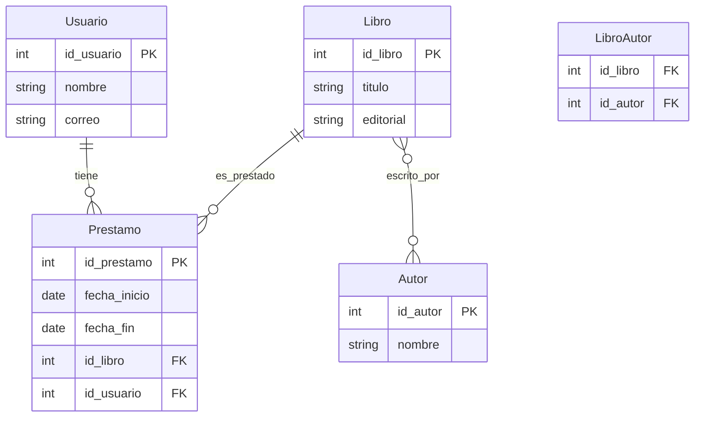

#  Clase: Diseño de Base de Datos Relacional

##  Objetivo
Diseñar una base de datos relacional completa obteniendo:
- Un **Diagrama Entidad-Relación (DER)**
- Su correspondiente **Modelo Relacional** (tablas)

---

##  Paso 1: Entiende los Requisitos

### ¿Qué se hace?
- Identificar lo que el sistema debe hacer.
- Determinar qué información se necesita almacenar y consultar.
- Detectar procesos clave del negocio.

###  Ejemplo de caso:
> "Queremos un sistema para registrar libros en una biblioteca, saber quién los tiene prestados y por cuánto tiempo."

###  Salida:
- Requisitos escritos (no diagrama aún).
- Ideas iniciales de entidades: `Libro`, `Usuario`, `Préstamo`.

---

##  Paso 2: Identifica las Entidades

### ¿Qué se hace?
- Determinar los objetos del mundo real que deben representarse.
- Cada entidad será una **caja** en el DER.

### Ejemplo:
- Entidades:  
  - `Libro`  
  - `Usuario`  
  - `Préstamo`  
  - `Autor`

###  Salida:
- Cuatro cajas en el DER.
- Lista base de entidades para el modelo relacional.

---

##  Paso 3: Identifica los Atributos

### ¿Qué se hace?
- Añadir los **atributos** a cada entidad.
- Definir **claves primarias**.

### Ejemplo:

**Entidad Libro**  
- id_libro (PK)  
- titulo  
- anio  
- editorial  

**Entidad Usuario**  
- id_usuario (PK)  
- nombre  
- correo  

**Entidad Préstamo**  
- id_prestamo (PK)  
- fecha_inicio  
- fecha_fin  

### ✅ Salida:
- DER con atributos y claves primarias.
- Columnas preliminares para el modelo relacional.

---

##  Paso 4: Identifica las Relaciones

### ¿Qué se hace?
- Establecer relaciones entre entidades.
- Definir cardinalidades (1:1, 1:N, N:M).

### Ejemplo:

- `Usuario` 🧍 — (1:N) — 📚 `Préstamo`
- `Libro` 📕 — (1:N) — `Préstamo`
- `Libro` 📘 — (N:M) — ✍️ `Autor`  
  → Crear entidad intermedia `LibroAutor`

###  Salida:
- Conexiones y líneas en el DER.
- Relaciones transformadas en claves foráneas en el modelo relacional.

---

##  Paso 5: Revisión y refinado del Diagrama

### ¿Qué se hace?
- Validar si el DER es claro y completo.
- Preparar el modelo relacional con:
  - Nombres de tablas
  - Columnas y tipos estimados
  - Claves primarias y foráneas

---

## 📊 Resultado final esperado

###  Diagrama Entidad-Relación (DER)



---

### 🔷 Modelo Relacional (SQL simplificado)

```sql
CREATE TABLE Usuario (
  id_usuario INT PRIMARY KEY,
  nombre VARCHAR(100),
  correo VARCHAR(100)
);

CREATE TABLE Libro (
  id_libro INT PRIMARY KEY,
  titulo VARCHAR(100),
  editorial VARCHAR(100)
);

CREATE TABLE Autor (
  id_autor INT PRIMARY KEY,
  nombre VARCHAR(100)
);

CREATE TABLE Prestamo (
  id_prestamo INT PRIMARY KEY,
  fecha_inicio DATE,
  fecha_fin DATE,
  id_libro INT,
  id_usuario INT,
  FOREIGN KEY (id_libro) REFERENCES Libro(id_libro),
  FOREIGN KEY (id_usuario) REFERENCES Usuario(id_usuario)
);

CREATE TABLE LibroAutor (
  id_libro INT,
  id_autor INT,
  PRIMARY KEY (id_libro, id_autor),
  FOREIGN KEY (id_libro) REFERENCES Libro(id_libro),
  FOREIGN KEY (id_autor) REFERENCES Autor(id_autor)
);
```
